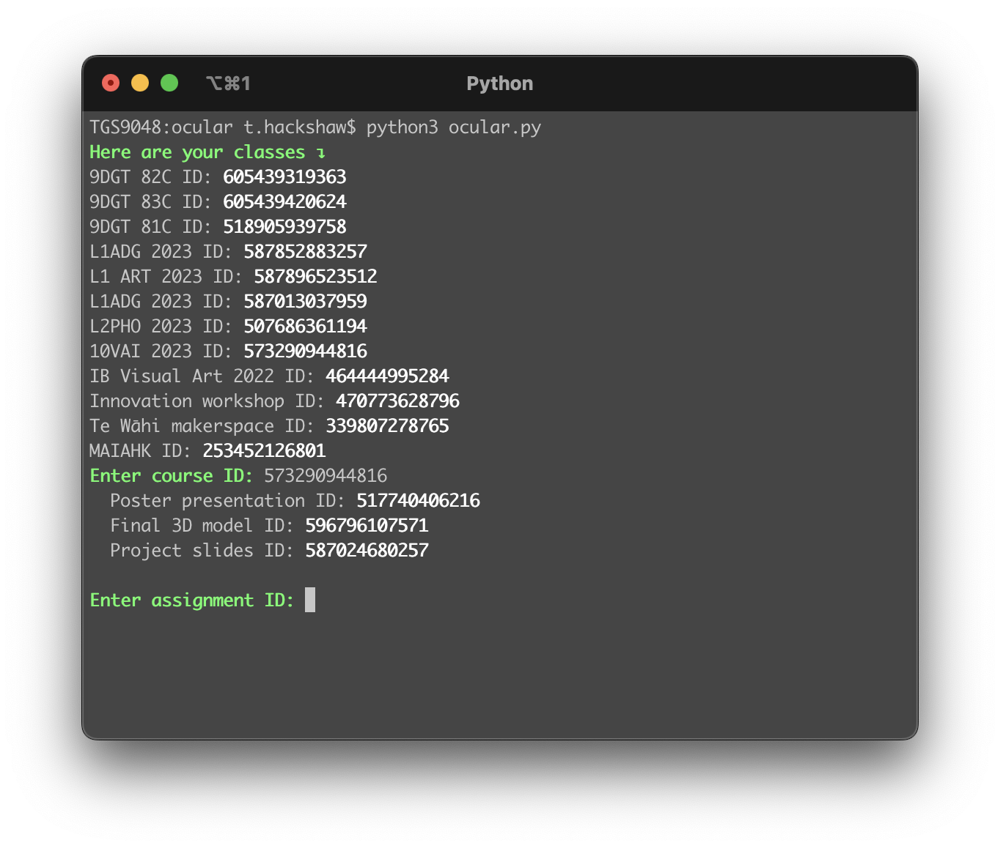

# Ocular

This Python app was a fun experiment to learn more about the uses of the Google Classroom API.

Upon running, it will load all classes that you (the teacher) are in charge of, and prompts you to enter the course ID and assignment ID. From here, it then displays a list of students and whether they have turned in the assignment or not.

## Prerequisites
To use this app, you'll need to have a teacher account on Google Classroom. You'll also need to set up a [Google Cloud Platform](https://cloud.google.com) project and enable the Classroom API. From here, you'll need to create credentials (OAuth 2.0 client ID) for your app and download a `credentials.json` file to use for authentication.

## Installation
- Clone this repository and cd into it 
```
git clone https://github.com/et0and/ocular.git
cd ocular
```
- Install the required packages by running `pip install -r requirements.txt`
- Transfer your `credentials.json` file from earlier into the root of your `ocular` folder
- Run the app using `python ocular.py`

## Issues
This app currently runs very slowly when fetching classes and does not have any caching implemented. I hope to add this soon and also generally improve the code.
